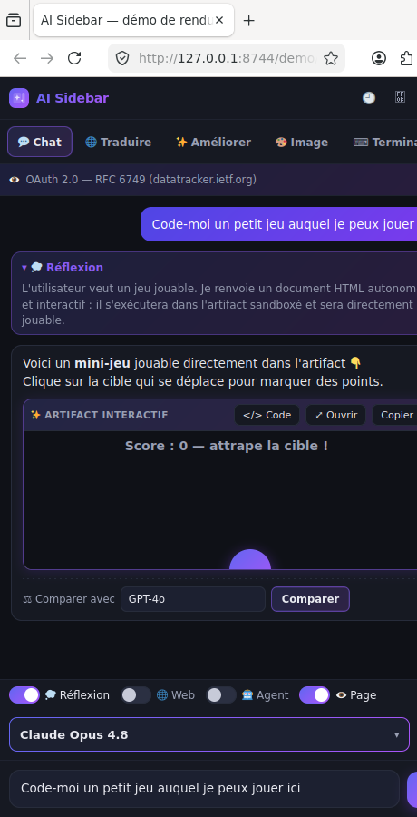

# Hivey AI — IA multi-fournisseurs pour Firefox & Chromium

  

Une extension **open-source** qui ajoute une **sidebar IA** à la manière de
[sider.ai](https://sider.ai), mais où **vous branchez votre propre IA** (BYOK) et
qui **interagit réellement avec la page et les onglets** — ce que la sidebar native
de Firefox ne permet pas. Un équivalent libre n'existait pas.

**Aucun backend, aucune télémétrie, aucune clé fournie.** Tout (clés, conversations,
base de connaissance, embeddings) reste dans votre navigateur.

## 10 espaces de travail

Une **barre latérale d'activité** à gauche (convention « activity bar » façon
VS Code / Slack — scale mieux qu'une rangée d'onglets) donne accès à :

| Espace | Rôle |
|---|---|
| 💬 **Chat** | Conversation avec la page comme contexte + DeepSearch, résumé, mindmap |
| 🌐 **Web chats** | Gemini, Claude, ChatGPT, Copilot, Mistral, DeepSeek, Qwen, Kimi, Z.ai, HuggingFace **dans la sidebar, sans clé API** (votre session web) |
| 🤖 **Agent** | L'IA lit, navigue, clique, remplit — autorisations réglables + garde-fou anti-achat |
| 🌍 **Traduire** | Traduction page / sélection |
| ✨ **Améliorer** | Réécriture avec styles (Marketing, Newsletter, Email pro, LinkedIn, Tweet, Blog…) |
| 🎨 **Image** | Génération d'images (endpoint compatible OpenAI) |
| 📄 **PDF** | Lecture d'un document et questions dessus |
| 🛡 **Sécurité** | Assistant **cybersécurité défensive** — analyse de capture `.pcap` résumée localement |
| 🧠 **Wisebase** | **Base de connaissance locale + RAG**, embeddings calculés dans le navigateur |
| `</>` **Code** | Atelier d'app IA complet (aperçu live, terminal, QR Expo Go) |

## Fonctionnalités

- 🐝 **Moteur Hivey — orchestration multi-modèles** : au lieu de choisir un modèle,
  choisissez une **intention**. Trois variantes (**🎁 Free**, **⚡ Smart**, **✨ Pro**)
  routent chaque message vers le meilleur modèle pour la tâche — un dispatcher LLM
  bon marché classe la demande (code / raisonnement / recherche / maths / créatif /
  test / trivial) et bascule sur le palier adéquat, avec repli heuristique si le
  dispatcher échoue. Le catalogue est **auto-curé quotidiennement**, sans version en dur.
- 🧠 **Wisebase (RAG 100% local)** : importez documents et pages dans des collections ;
  le texte est découpé, **vectorisé dans le navigateur** (transformers.js +
  onnxruntime WASM, modèle `all-MiniLM-L6-v2`) et stocké en **IndexedDB**. Les
  réponses citent vos sources. Rien n'est jamais téléversé ; désinstaller l'extension
  purge la base.
- 🔎 **DeepSearch** : bascule de recherche web approfondie dans le chat, avec une
  **profondeur réglable** (rapide / standard / approfondie).
- 🗺 **Mindmap** : génère une **carte mentale ou un flowchart Mermaid** à partir d'une
  réponse ou de la page courante, dans un panneau dédié.
- 📚 **Prompt Library** : prompts prêts à l'emploi (rédaction, code, cybersec,
  marketing, productivité, apprentissage, business, data) + vos propres prompts,
  favoris et insertion en un clic.
- ⚡ **Skills & slash-commands** : `/skill` applique un prompt d'expert qui reste actif
  (chip) et rend **n'importe quel modèle** meilleur sur un domaine — pur prompt
  engineering côté client, donc compatible avec tous les fournisseurs.
- 📊 **Modèles classés par spécialité** : chaque espace trie sa liste de modèles selon
  un **index de qualité curé par catégorie** (les endpoints `/models` n'exposent aucun
  score) — le picker de l'onglet Image ne classe pas comme celui de l'onglet Code.
- ⌨️ **Raccourcis clavier configurables** (nouveau chat, focus composer, historique…).
- 🔐 **Sauvegarde/synchro chiffrée** : export d'un blob **AES-256-GCM** (PBKDF2, 100k
  itérations) de vos réglages et clés, à transporter vers un autre appareil.
  Rien ne transite par un serveur — la synchro, c'est vous qui déplacez le fichier.
- 📤 **Export de conversation** (impression / PDF via le rendu natif du navigateur).
- 🎨 **Interface moderne & personnalisable** : **6 thèmes** (Dark, Hive, Modern, Neon,
  Sunset, Light) avec **personnalisation des couleurs par-dessus** (accent, fond,
  surface, texte) et une **pipette** pour capturer une couleur à l'écran.
- 🎨 **Interface moderne & personnalisable** : plusieurs **thèmes** (Default, Pro,
  Gamer, Modern, Sunset, Light) avec **personnalisation des couleurs par-dessus**
  (accent, fond, surface, texte) et une **pipette** pour capturer une couleur à
  l'écran. Zone de saisie unifiée façon Claude/Gemini, et un **sélecteur de modèle
  unifié** au-dessus du chat (une seule liste groupée par fournisseur connecté).
- 🌍 **Interface multilingue** : anglais, français, espagnol, allemand, italien,
  portugais (réglable dans les paramètres).
- 🔌 **Tous les fournisseurs** : **Claude**, **OpenAI**, **Gemini**, **Mistral**,
  **Groq**, **DeepSeek**, **xAI (Grok)**, **Perplexity**, **Together**, **Fireworks**,
  **DeepInfra**, **Cerebras**, **Cohere**, **OpenRouter**, et les **modèles locaux**
  **Ollama** / **LM Studio** (ou tout serveur compatible OpenAI via URL personnalisée).
- 📋 **Seulement les modèles disponibles** : la liste (unifiée, juste au-dessus du
  chat) n'affiche que les fournisseurs **connectés** (clé/compte/serveur local) et,
  pour chacun, les **modèles réellement accessibles** à votre clé (lus en direct via
  l'endpoint `/models`).
- 🔑 **Connexion par compte** : bouton **« Se connecter avec OpenRouter »** (OAuth
  PKCE — login Google / GitHub / email côté OpenRouter) qui débloque tous les
  modèles. Les autres fournisseurs utilisent une clé API (ils n'offrent pas d'OAuth).
- ⚖️ **Comparaison de modèles** : sur **la dernière réponse**, un bouton
  **« Comparer »** rejoue votre demande sur **un autre modèle**, directement dans le chat.
- 🧩 **Artifacts interactifs (façon Claude)** : demandez une app, un outil ou un
  **jeu** → l'IA renvoie un document HTML/JS (ou un composant **React/JSX**) qui
  s'exécute dans un aperçu sandboxé **et avec lequel vous interagissez/jouez**
  directement. (Mermaid/SVG pour les diagrammes.)
- 🕘 **Historique local** : vos conversations sont enregistrées **uniquement dans
  ce navigateur** (privacy) ; liste, rechargement, et « tout effacer ».
- 🌐 **Web chats sans clé API** : dix IA grand public (Gemini, Claude, ChatGPT,
  Copilot, Mistral, DeepSeek, Qwen, Kimi, Z.ai, HuggingFace) s'ouvrent **dans la
  sidebar**, via votre session web déjà connectée — utile quand vous n'avez pas de
  clé ou que votre abonnement est déjà payé.
- 🛡 **Espace Sécurité défensive** : assistant orienté défense, avec un parseur
  `.pcap` **côté client** qui ne produit qu'un **résumé anonymisé** (flux, top
  talkers/ports, mix protocolaire, heuristiques de scan TCP) — **jamais** les
  charges utiles. Seul ce résumé peut partir vers le modèle.
- 🌍 **Interface multilingue** : anglais, français, espagnol, allemand, italien,
  portugais (réglable dans les paramètres).
- 👁 **L'IA voit la page** : le contenu est lu automatiquement à l'ouverture d'un
  site **et à chaque navigation** (y compris changement de sous-domaine et
  navigations SPA), puis utilisé comme support pour répondre.
- 📑 **Lecture multi-onglets** : cochez plusieurs onglets ouverts pour les donner
  comme contexte à l'IA (comparer, synthétiser, recouper).
- ⚡ **Actions rapides** + **clic droit** : Résumer / Traduire la **page** ou la
  **sélection**, Expliquer, Améliorer, **Rédiger une réponse**.
- 🔍 **Recherche dans la conversation**, **glisser-déposer** de fichiers, et un
  **outil de capture de zone** (📸) qui ajoute une capture d'écran de la page au contexte.
- 💭 **Thinking** : le raisonnement du modèle (extended thinking de Claude,
  `reasoning` de DeepSeek / o-series) s'affiche dans un bloc repliable.
- 🤖 **Espace Agent** (onglet dédié) : l'IA peut lire la page/les onglets, naviguer,
  cliquer, remplir des champs. **Autorisations réglables** : *Autoriser* (par défaut —
  exécution automatique, mais les **actions sensibles** comme télécharger, réserver,
  supprimer, s'inscrire demandent quand même confirmation) ou *validation manuelle*
  (confirmation avant chaque action). Un **liseré lumineux** s'affiche sur la page
  pendant que l'agent travaille.
  Dans les deux cas, le **garde-fou anti-achat** s'applique : elle peut remplir un
  panier mais **ne peut jamais payer/commander**. Un **modèle d'agent** dédié est
  réglable (beaucoup de modèles rapides/gratuits ne savent pas appeler d'outils).
- 🛠 **Espace Code — atelier d'app IA** : ouvre, dans un **nouvel onglet isolé**, un
  builder d'apps web & mobiles — **HiveyCode** (`https://app.hivey.be` par défaut) — avec
  **génération de code par une boucle d'agents** (planner → coder → reviewer → debugger),
  **aperçu live**, **terminal intégré** et **QR code Expo Go** pour tester sur mobile.
  L'URL de l'atelier est **configurable** dans les réglages (votre instance
  auto-hébergée ou l'instance publique). *Pourquoi un onglet et pas une
  iframe ?* le builder s'appuie sur **WebContainers**, qui exigent l'isolation
  cross-origine (COOP/COEP) impossible dans une iframe d'extension — le nouvel onglet
  préserve preview, terminal et Expo Go.
- 🔒 **100% BYOK, zéro rétention serveur** : aucune clé fournie, **aucun serveur**,
  aucune télémétrie. Vos clés et données restent **locales** (`storage.local`),
  jamais synchronisées, envoyées uniquement à l'API que vous choisissez.

## Capture



> ⚠️ **Capture datée (v1.4, juin 2026)** — elle montre l'ancienne barre d'activité à
> 7 espaces. L'interface actuelle en compte **10** (ajout de Web chats, Sécurité et
> Wisebase) et le sélecteur Hivey a remplacé la liste brute de modèles.
> Capture générée via `demo/index.html`, rendue dans Firefox sous Xvfb.
> *Contribution bienvenue : une capture à jour.*

## Installation

### Firefox (développement)

1. Ouvrir `about:debugging#/runtime/this-firefox`
2. **Charger un module complémentaire temporaire…**
3. Sélectionner `manifest.json` à la racine de ce dépôt
4. La sidebar s'ouvre via l'icône de la barre latérale ou `Ctrl+Shift+Y`
5. Cliquer ⚙ **Réglages** et renseigner **au moins une clé API** (ou pointer un
   modèle local Ollama / LM Studio, sans clé)

### Chromium (Chrome / Edge / Brave…)

L'extension est **cross-browser** : le même code tourne sur Chromium grâce à
[`browser-polyfill`](https://github.com/mozilla/webextension-polyfill) et à un
manifest dédié (`side_panel` + service worker au lieu de `sidebar_action`).

1. Construire le paquet : `bash scripts/build-chrome.sh` → `ai-sidebar-chrome-<version>.zip`
   (ou décompresser le zip fourni)
2. Ouvrir `chrome://extensions`, activer le **Mode développeur**
3. **« Charger l'extension non empaquetée »** → sélectionner le dossier `.build-chrome/`
   (ou le contenu décompressé du zip)
4. Cliquer l'icône de la barre d'outils pour ouvrir le **panneau latéral**

> Note : Chrome ne permet pas la distribution d'un `.crx` permanent hors
> **Chrome Web Store** (compte développeur payant). Le chargement « non empaqueté »
> ci-dessus est la voie sans store ; il nécessite de garder le Mode développeur actif.

## Fournisseurs

| Fournisseur | Type | Clé requise | Notes |
|---|---|---|---|
| Claude (Anthropic) | natif | ✅ | thinking + recherche web ; liste `/v1/models` |
| OpenAI | compatible OpenAI | ✅ | images (gpt-image-1 / DALL·E 3) |
| Google Gemini | compatible OpenAI | ✅ | endpoint `/v1beta/openai` |
| Mistral, Groq, DeepSeek | compatible OpenAI | ✅ | DeepSeek R1 = raisonnement |
| xAI (Grok), Perplexity | compatible OpenAI | ✅ | Grok / Sonar |
| Together, Fireworks, DeepInfra, Cerebras, Cohere | compatible OpenAI | ✅ | open-weights + listing `/models` |
| OpenRouter | compatible OpenAI | ✅ (ou OAuth) | catalogue géant, **connexion par compte** |
| Local (Ollama) | compatible OpenAI | ❌ | `http://localhost:11434/v1` |
| Local (LM Studio) | compatible OpenAI | ❌ | `http://localhost:1234/v1` |
| Personnalisé | compatible OpenAI | optionnel | n'importe quelle URL `/v1` |

> Les serveurs locaux fonctionnent sans configuration CORS : l'extension dispose
> des *host permissions* et n'est donc pas soumise au CORS du navigateur.

## Architecture

```
manifest.json            MV3 Firefox (sidebar_action, event page)
manifest.chrome.json     MV3 Chromium (side_panel, service worker)
scripts/build-chrome.sh  Assemble le paquet Chromium (.zip / dossier)
src/
  background/sw-chrome.js  Entrée service worker Chromium (importScripts)
  background/            Event page : menus contextuels (résumer/traduire/…)
  sidebar/               UI principale (chat, streaming, thinking, actions rapides)
  content/               Lecture page + actions DOM + notif. de navigation SPA
  options/               Réglages générés dynamiquement (clés BYOK par fournisseur)
  lib/
    models.js            Catalogue des fournisseurs + modèles + presets d'écriture
    providers.js         Client Anthropic natif + client générique OpenAI ; images
    agent.js             Boucle d'agent (tours modèle ↔ outils)
    tools.js             Outils navigateur (onglets, DOM) + exécuteur
    auth.js              Connexion OAuth (PKCE) OpenRouter via browser.identity
    history.js           Historique local des conversations (storage.local)
    storage.js           Réglages locaux (clés/modèles/URLs, autorisations agent, URL atelier Code)
    markdown.js          Rendu Markdown + artifacts interactifs (HTML/JS, React, SVG, Mermaid)
    hivey-models.js      Moteur Hivey : paliers par capacité, auto-curation du catalogue
    benchmarks.js        Index de qualité curé par famille de modèle et par catégorie
    wisebase.js          Base de connaissance locale + RAG (collections, chunks, IndexedDB)
    embeddings.js        Embeddings calculés dans le navigateur (transformers.js / WASM)
    skills.js            Skills experts + objectifs, exposés en slash-commands
    prompts.js           Prompt Library intégrée (8 catégories, bilingue)
    pcap.js              Parseur .pcap client → résumé défensif anonymisé
    shortcuts.js         Raccourcis clavier configurables
    syncCrypto.js        Export/import chiffré AES-256-GCM des réglages (PBKDF2)
    exportConversation.js Export/impression d'une conversation
    theme.js             6 thèmes + surcouche de couleurs personnalisées
    i18n.js / i18n-langs.js  Traductions UI (en, fr, es, de, it, pt)
    dom.js               Point d'insertion HTML unique (audit sécurité)
```

### Détails techniques

- **MV3 / Firefox** : `sidebar_action` (équivalent Chrome : `side_panel`).
  Le background est un *event page* (`background.scripts`).
- **Un seul client pour presque tout** : la majorité des fournisseurs parlent le
  dialecte OpenAI (`/chat/completions`, `/models`, `/images/generations`). Un
  client générique paramétré par `baseUrl` + `apiKey` les couvre tous ; seul
  Anthropic a son client natif (extended thinking, recherche web serveur).
- **Anthropic depuis le navigateur** : header
  `anthropic-dangerous-direct-browser-access: true` + `x-api-key` +
  `anthropic-version: 2023-06-01`.
- **Les « yeux »** : la sidebar écoute `tabs.onActivated` / `tabs.onUpdated` et les
  notifications SPA du content script ; à chaque navigation elle relit la page,
  l'affiche dans un chip et l'injecte (mode chat) ou la laisse à l'agent (mode agent).
- **Thinking** : blocs `thinking` d'Anthropic (avec signature conservée pour rester
  valide au tour suivant) et `reasoning`/`reasoning_content` côté OpenAI/DeepSeek.

## Sécurité & confidentialité

- **Zéro rétention serveur** : l'extension n'a **aucun backend**. Aucune donnée
  (clés, conversations, contenu des pages) ne transite par un serveur tiers — tout
  reste dans le navigateur et n'est envoyé qu'à l'API IA que **vous** choisissez.
  Pas d'analytique, pas de télémétrie.
- Les clés API sont stockées via `browser.storage.local` (jamais synchronisées).
  **Aucune clé n'est fournie** : le dépôt est livré vierge.
- **Garde-fou anti-transaction** : en mode agent, les actions de
  paiement/commande/saisie de carte sont **refusées dans le code** (content script),
  pas seulement dans le prompt — un prompt détourné ne peut pas les contourner.
  L'agent s'arrête au panier.
- **Anti prompt-injection** : le contenu des pages, onglets et sélections est traité
  comme une **donnée non fiable**. Le prompt système interdit d'obéir à des
  instructions trouvées dans une page et de divulguer les clés/réglages.
- **Autorisations de l'agent réglables** : en *Autoriser* (par défaut) l'agent
  s'exécute seul mais **confirme les actions très sensibles** (téléchargement,
  réservation, suppression, virement, inscription, installation…) ; en *validation
  manuelle* chaque action modifiant l'état est confirmée ; en *tout autoriser* l'agent enchaîne
  sans demande — mais le **garde-fou anti-achat reste actif dans les deux cas**
  (refus codé en dur, indépendant du prompt). Le défaut sûr est la validation manuelle.
- **Espace Code isolé** : l'atelier d'app IA s'ouvre dans un **onglet distinct**
  (origine séparée, protégé côté serveur). Aucune clé, aucun réglage et aucune donnée
  de la sidebar n'est partagé avec l'atelier ; l'URL cible est explicitement
  configurée par l'utilisateur (pas de redirection silencieuse). La séparation
  d'origine (WebContainers/COOP-COEP) qui empêche l'embarquement en iframe **renforce**
  aussi l'isolation : la sidebar et l'atelier ne partagent pas de contexte d'exécution.
- **Wisebase entièrement local** : les collections, les extraits de texte **et les
  vecteurs d'embedding** vivent en IndexedDB. Les embeddings sont calculés **dans le
  navigateur** (moteur WASM embarqué dans l'extension) ; seul le *modèle* (~23 Mo) est
  téléchargé une fois depuis le CDN Hugging Face puis mis en cache. Aucun texte ne sort.
- **Analyse `.pcap` anonymisante** : le parseur tourne côté client et ne produit qu'un
  **résumé statistique** (flux, ports, protocoles). Les charges utiles ne sont ni
  extraites ni envoyées.
- **Sauvegarde chiffrée, pas de cloud** : l'export des réglages est chiffré en
  **AES-256-GCM** avec une clé dérivée par **PBKDF2 (100 000 itérations)**. Le fichier
  est déplacé par vos soins — il n'existe aucun serveur de synchro.
- **Point d'insertion HTML unique** : toute écriture de HTML passe par `src/lib/dom.js`,
  ce qui réduit la surface XSS à un seul fichier auditable. Le Markdown du modèle est
  systématiquement passé dans **DOMPurify** avant rendu.
- **`declarativeNetRequest` au périmètre minimal** : les règles ne s'appliquent qu'aux
  **11 domaines de chat web** effectivement supportés — aucun domaine
  d'authentification, aucun domaine parent large.
- **CSP stricte** sur les pages d'extension (`script-src 'self'`) ; les artifacts
  (HTML/JS/React/SVG/Mermaid) s'exécutent en **iframe sandboxée** (origine opaque,
  sans `allow-same-origin`), isolés de l'extension, des pages et des clés.
- **Historique 100% local** : les conversations sont stockées dans
  `storage.local` (jamais synchronisées) ; désactivable et effaçable dans les réglages.
- **Note artifacts React** : un artifact `jsx`/`react` charge React + Babel depuis
  un CDN public (`unpkg`) **à l'intérieur de l'iframe sandboxée uniquement**, et
  seulement quand un tel artifact est affiché. Les artifacts **HTML/JS** (jeux, apps)
  ne dépendent d'aucun CDN. La connexion OpenRouter passe par `browser.identity`.
- `anthropic-dangerous-direct-browser-access` expose la clé Anthropic au contexte
  navigateur de l'utilisateur (BYOK assumé) — acceptable car chacun fournit la sienne.

## Rendu Markdown & artifacts

Réponses rendues en **Markdown** (marked + DOMPurify, vendorés dans `vendor/`).
Blocs de code avec barre d'outils (**Copier**), et des **artifacts interactifs**
(façon Claude) dans des **iframes sandboxées**, avec bascule **Aperçu / Code** et
bouton **Ouvrir** (plein écran) :

- ` ```html ` → **app / jeu / outil** autonome, exécuté et **jouable** dans l'aperçu
- ` ```jsx ` (ou `react`) → **composant React** (définir `App`), transpilé en direct
- ` ```svg ` → graphique vectoriel rendu
- ` ```mermaid ` → diagramme rendu automatiquement

## Feuille de route

- [x] Multi-fournisseurs + modèles locaux (Ollama / LM Studio / custom)
- [x] Moteur **Hivey** : orchestration multi-modèles (Free / Smart / Pro) + auto-curation du catalogue
- [x] **Wisebase** : base de connaissance locale + RAG, embeddings dans le navigateur
- [x] **DeepSearch**, **Mindmap**, **Prompt Library**, **Skills** en slash-commands
- [x] **Web chats sans clé API** (10 IA grand public dans la sidebar)
- [x] **Espace Sécurité défensive** + parseur `.pcap` anonymisant côté client
- [x] Lecture auto de la page à chaque navigation (sous-domaine, SPA) + multi-onglets
- [x] Espace agent avec autorisations réglables + garde-fou anti-achat
- [x] Espace Code : atelier d'app IA en nouvel onglet (preview, terminal, Expo Go)
- [x] Artifacts interactifs façon Claude (HTML/JS jouable, React/JSX)
- [x] Historique local, export de conversation, sauvegarde chiffrée, raccourcis configurables
- [x] 6 thèmes + couleurs personnalisées, interface en 6 langues
- [x] **Conformité magasins** : `addons-linter` **0 erreur / 0 note**, manifests Firefox
      et Chromium dédiés, périmètre `declarativeNetRequest` restreint, déclaration de
      collecte de données — voir [PUBLISHING.md](PUBLISHING.md)
- [ ] Soumission **AMO** (canal *listed*)
- [ ] Soumission **Chrome Web Store**
- [ ] Capture d'écran du README à régénérer (UI à 10 espaces)

## Documentation

| Document | Contenu |
|---|---|
| [PUBLISHING.md](PUBLISHING.md) | Publication pas-à-pas sur **AMO**, **Chrome Web Store** et **Edge** : signature *unlisted*, auto-update auto-hébergé, justification de **chaque permission**, réponses de l'onglet « Confidentialité », checklist avant soumission |
| [REVIEWERS.md](REVIEWERS.md) | Note aux relecteurs : build reproductible, libs vendorées, avertissements attendus et pourquoi, déclaration de collecte de données, périmètre `declarativeNetRequest` |

## Licence

MIT — voir [LICENSE](./LICENSE).

## Building / reviewers

The extension ships hand-written, non-minified source (only `vendor/` holds unmodified third-party libraries). To reproduce the exact packages: `bash scripts/build.sh`. Verify the third-party libs with `bash scripts/fetch-vendor.sh --check`. Full reviewer/build documentation: see [REVIEWERS.md](REVIEWERS.md).
